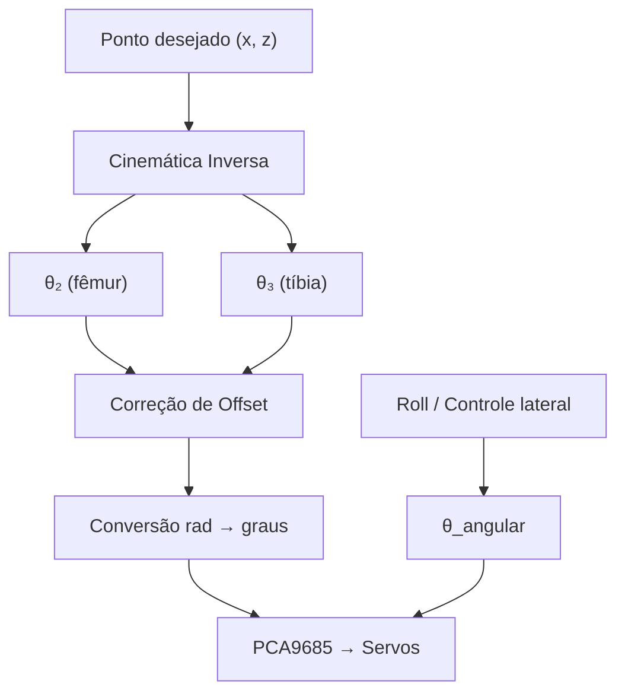
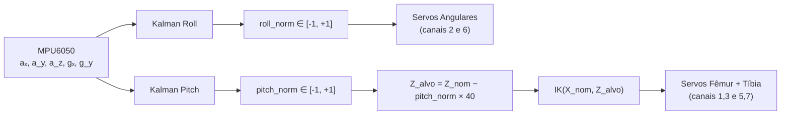

# Cinemática do Robô Quadrúpede - Robot Dog Mauá

> Documentação dos cálculos de cinemática implementados em [`test/leg_test/v3/`](../test/leg_test/v3), responsáveis por toda a movimentação do robô.

---

## Sumário

1. [Visão Geral da Arquitetura](#1-visão-geral-da-arquitetura)
2. [Modelo Geométrico da Perna](#2-modelo-geométrico-da-perna)
3. [Cinemática Inversa (IK) — 2 DOF no plano XZ](#3-cinemática-inversa-ik--2-dof-no-plano-xz)
4. [Correção Angular (Offset dos Servos)](#4-correção-angular-offset-dos-servos)
5. [Espelhamento da Perna Esquerda](#5-espelhamento-da-perna-esquerda)
6. [Servo Angular — 3º Grau de Liberdade (Eixo Y / Roll)](#6-servo-angular--3º-grau-de-liberdade-eixo-y--roll)
7. [Cinemática da Marcha (Gait)](#7-cinemática-da-marcha-gait)
8. [Estabilização Ativa (Roll + Pitch + Filtro de Kalman)](#8-estabilização-ativa-roll--pitch--filtro-de-kalman)
9. [Curvas de Suavização](#9-curvas-de-suavização)
10. [Limites e Proteções](#10-limites-e-proteções)
11. [Mapa de Servos](#11-mapa-de-servos)
12. [Referências de Código](#12-referências-de-código)

---

## 1. Visão Geral da Arquitetura

O robô quadrúpede possui **4 pernas**, cada uma com **3 servos** (3 DOF):

| Servo | Nome | Função |
|-------|------|--------|
| **Fêmur** | Servo superior | Controla θ₂ — rotação do braço superior (plano XZ) |
| **Tíbia** | Servo inferior | Controla θ₃ — rotação do braço inferior (plano XZ) |
| **Angular** | Servo de rotação | Controla a rotação lateral da perna (eixo Y / roll) |

O controle é feito por um **PCA9685** (16 canais PWM) conectado via I2C ao Raspberry Pi 4.



---

## 2. Modelo Geométrico da Perna

Cada perna é modelada como um **mecanismo de dois elos** (serial linkage) no plano **XZ**:

```
         Ombro (origem)
            ●
           /
          / L₁ = 120 mm (fêmur / upper leg)
         /
        ● Joelho
         \
          \ L₂ = 130 mm (tíbia / lower leg)
           \
            ● Pé (x, z)
```

| Parâmetro | Valor | Descrição |
|-----------|-------|-----------|
| `UPPER_LEG` (L₁) | 120 mm | Comprimento do fêmur |
| `LOWER_LEG` (L₂) | 130 mm | Comprimento da tíbia |
| `MAX_RADIUS` | 220 mm | Alcance máximo do pé (L₁ + L₂ - margem) |

### Sistema de Coordenadas

- **Origem**: articulação do ombro (eixo do servo fêmur)
- **Eixo X**: positivo para frente do robô
- **Eixo Z**: positivo para cima (valores negativos = pé abaixo do corpo)
- **Plano de trabalho**: XZ (2D), com o eixo Y controlado separadamente pelo servo angular

---

## 3. Cinemática Inversa (IK) — 2 DOF no plano XZ

A cinemática inversa calcula os ângulos articulares (θ₂, θ₃) a partir da posição desejada do pé (x, z).

### 3.1 Distância ao ponto-alvo

Primeiro, calcula-se a distância euclidiana entre a origem (ombro) e o pé:

$$
B = \|P\| = \sqrt{x^2 + z^2}
$$

> **Nota**: no código, `norm([x, 0, z])` é usado, incluindo componente y = 0 para compatibilidade tridimensional futura, mas o resultado é equivalente a √(x² + z²).

### 3.2 Lei dos Cossenos — Ângulos do triângulo

Com os três lados do triângulo (L₁, L₂, B), aplica-se a **Lei dos Cossenos** para obter os ângulos auxiliares:

```
       Ombro
         /\
    L₁  /  \ B
       / β₂ \
      /______\
  Joelho  L₂  Pé
```

**Ângulo β₁** — ângulo entre o eixo +X e o vetor ombro → pé:

$$
\beta_1 = \text{atan2}(z, x) \mod 2\pi
$$

**Ângulo β₂** — ângulo entre o vetor ombro → pé e o segmento L₁ (fêmur):

$$
\beta_2 = \arccos\left(\frac{L_1^2 + B^2 - L_2^2}{2 \cdot L_1 \cdot B}\right)
$$

**Ângulo β₃** — ângulo entre os segmentos L₁ e L₂ (ângulo interno do joelho):

$$
\beta_3 = \arccos\left(\frac{L_1^2 + L_2^2 - B^2}{2 \cdot L_1 \cdot L_2}\right)
$$

### 3.3 Cálculo dos ângulos articulares

**θ₂** (fêmur) — ângulo absoluto do braço superior em relação ao eixo +X:

$$
\theta_2 = \beta_1 - \beta_2
$$

**θ₃** (tíbia) — ângulo relativo do joelho (0 = extensão total):

$$
\theta_3 = \pi - \beta_3
$$

### 3.4 Implementação no código

A função [`_ik(x, z)`](../test/leg_test/v3/auxiliar_funcs/leg_flexion.py#L33-L49) encapsula todo o cálculo:

```python
def _ik(x, z):
    len_B = norm([x, 0, z])
    
    # Lei dos Cossenos com clamp para segurança numérica
    arg_b2 = np.clip((L1² + B² - L2²) / (2·L1·B), -1, 1)
    arg_b3 = np.clip((L1² + L2² - B²) / (2·L1·L2), -1, 1)
    
    b_1 = atan2(z, x)          # ângulo do vetor posição
    b_2 = acos(arg_b2)         # ângulo entre vetor e fêmur
    b_3 = acos(arg_b3)         # ângulo interno do joelho
    
    theta_2 = b_1 - b_2        # ângulo do fêmur
    theta_3 = π - b_3          # ângulo da tíbia (relativo)
    
    return angle_corrector([theta_2, theta_3])
```

---

## 4. Correção Angular (Offset dos Servos)

Os ângulos θ₂ e θ₃ calculados pela IK estão no referencial matemático padrão (eixo +X horizontal). Porém, os servos estão montados com offsets mecânicos, então é necessário corrigir.

A função [`_angle_corrector(angles)`](../test/leg_test/v3/auxiliar_funcs/leg_flexion.py#L27-L30) aplica as correções:

### θ₂ corrigido (fêmur)

O servo do fêmur assume que **90° = perna apontando para baixo** (posição padrão). No referencial matemático, "para baixo" corresponde a 270° (3π/2), ou seja, −π/2 do eixo +X:

$$
\theta_{2\_servo} = \theta_2 - \frac{\pi}{2}
$$

### θ₃ corrigido (tíbia)

O servo da tíbia é relativo ao fêmur, e o ângulo de montagem (0°) assume alinhamento na posição 5π/4 (225°) do referencial do fêmur:

$$
\theta_{3\_servo} = \theta_2 + \theta_3 - \frac{5\pi}{4}
$$

### Conversão para graus e offset adicional

Após a correção, os ângulos em radianos são convertidos para graus e aplicados aos servos com um **offset de −8°** na tíbia (compensação de folga mecânica):

```python
servo_femur.angle = θ₂_corrigido × (180/π)
servo_tibia.angle = θ₃_corrigido × (180/π) − 8
```

---

## 5. Espelhamento da Perna Esquerda

As pernas esquerda e direita são montadas de forma **simétrica (espelhada)**. Como os servos giram no mesmo sentido, o ângulo da perna esquerda é espelhado em 180°:

```python
# Perna direita (direta)
servo_femur_dir.angle = θ₂_corrigido × (180/π)
servo_tibia_dir.angle = θ₃_corrigido × (180/π) − 8

# Perna esquerda (espelhada)
servo_femur_esq.angle = 180 − θ₂_corrigido × (180/π)
servo_tibia_esq.angle = 180 − (θ₃_corrigido × (180/π) − 8)
```

Referência: [leg_flexion.py, linhas 83–88](../test/leg_test/v3/auxiliar_funcs/leg_flexion.py#L83-L88)

---

## 6. Servo Angular — 3º Grau de Liberdade (Eixo Y / Roll)

O servo angular controla a **abdução/adução** da perna, ou seja, a rotação lateral em torno do eixo X do robô. Ele é independente da IK planar (XZ) e é controlado diretamente.

| Servo | Canal | Mínimo | Máximo | Centro | Faixa (±) |
|-------|-------|--------|--------|--------|-----------|
| Angular Direito | 2 | 70° | 120° | 95° | 25° |
| Angular Esquerdo | 6 | 90° | 135° | 112.5° | 22.5° |

Na **locomoção**, o servo angular oscila entre os limites de forma sincronizada com as fases da marcha, simulando a transferência lateral de peso natural de um quadrúpede.

---

## 7. Cinemática da Marcha (Gait)

A locomoção é implementada em [leg_test.py](../test/leg_test/v3/auxiliar_funcs/leg_test.py) usando um **gait bípede alternado** (trot-like) com as pernas frontais defasadas em 180°.

### 7.1 Parâmetros da Marcha

| Parâmetro | Valor | Descrição |
|-----------|-------|-----------|
| `Z_APOIO` | −150 mm | Altura do pé durante o apoio no solo |
| `Z_SWING` | −85 mm | Altura máxima do pé durante o balanço |
| `X_FRENTE` | +60 mm | Posição X frontal (avanço máximo) |
| `X_ATRAS` | −60 mm | Posição X traseira (recuo máximo) |
| `N_PONTOS` | 20 | Pontos de interpolação por fase |
| `DELAY` | 15 ms | Intervalo entre pontos (~67 Hz) |

### 7.2 Fases da Marcha

Cada perna alterna entre duas fases:

#### Fase 1 — Swing (Balanço): perna no ar

A perna descreve um **arco senoidal** no plano XZ, subindo e avançando simultaneamente:

```
Z_SWING ─ ─ ─ ─●───────●  ← arco senoidal
              ╱         ╲
             ╱           ╲
Z_APOIO ─ ─ ●             ● ─ ─ ─ ─
          X_ATRAS         X_FRENTE
```

$$
x(i) = X_{ATRAS} + (X_{FRENTE} - X_{ATRAS}) \cdot \frac{i}{N-1}
$$

$$
z(i) = Z_{APOIO} + (Z_{SWING} - Z_{APOIO}) \cdot \sin\left(\frac{\pi \cdot i}{N-1}\right)
$$

A cada ponto, a IK é chamada para calcular os ângulos dos servos.

#### Fase 2 — Apoio (Stance): perna no solo

A perna desliza em linha reta no solo com Z constante, empurrando o corpo para frente:

$$
x(i) = X_{FRENTE} + (X_{ATRAS} - X_{FRENTE}) \cdot \frac{i}{N-1}, \quad z = Z_{APOIO}
$$

### 7.3 Defasagem entre pernas (Anti-fase)

As pernas direita e esquerda operam em **anti-fase** (180° defasadas):

| Instante | Perna Direita | Perna Esquerda |
|----------|---------------|----------------|
| t₀ | **Swing** (atrás → frente, arco) | **Apoio** (frente → atrás, solo) |
| t₁ | **Apoio** (frente → atrás, solo) | **Swing** (atrás → frente, arco) |

```mermaid
gantt
    title Fases da Marcha (Ciclo Contínuo)
    dateFormat X
    axisFormat %s

    section Perna Direita
    Swing (atrás→frente)     :active, 0, 20
    Apoio (frente→atrás)     :20, 40

    section Perna Esquerda
    Apoio (frente→atrás)     :active, 0, 20
    Swing (atrás→frente)     :20, 40
```



### 7.4 Oscilação do Servo Angular na Marcha

Durante a marcha, o servo angular oscila linearmente entre seus limites, sincronizado com as fases:

- **Perna Direita**: `ANG_MIN(70°) → ANG_MAX(120°)` no swing, e o inverso no apoio
- **Perna Esquerda**: `ANG_MIN(90°) → ANG_MAX(135°)` no apoio, e o inverso no swing

Isso simula a transferência de peso lateral natural do quadrúpede.

---

## 8. Estabilização Ativa (Roll + Pitch + Filtro de Kalman)

O módulo [stabilization.py](../test/leg_test/v3/auxiliar_funcs/stabilization.py) implementa estabilização em tempo real usando o **MPU6050** (acelerômetro + giroscópio) com **filtro de Kalman**.

### 8.1 Filtro de Kalman

O filtro combina as leituras do acelerômetro (baixa frequência, sem drift) e do giroscópio (alta frequência, com drift) para obter uma estimativa suave e precisa do ângulo:

**Modelo de estado**:
- Estado: `[ângulo, bias_do_giroscópio]`
- Predição: `ângulo += (taxa_giro - bias) × dt`
- Atualização: correção com o ângulo do acelerômetro

| Parâmetro | Valor | Significado |
|-----------|-------|-------------|
| `Q_angle` | 0.001 | Confiança no modelo do ângulo |
| `Q_bias` | 0.003 | Variação esperada do bias |
| `R_measure` | 0.03 | Ruído da medição do acelerômetro |

Referência: [classe _KalmanFilter](../test/leg_test/v3/auxiliar_funcs/stabilization.py#L61-L87)

### 8.2 Cálculo do Roll e Pitch a partir do Acelerômetro

```python
roll  = atan2(-aₓ, a_z)                    # inclinação lateral
pitch = atan2(a_y, √(aₓ² + a_z²))          # inclinação frontal
```

### 8.3 Compensação de Roll → Servos Angulares

O roll filtrado é normalizado para a faixa [−1, +1] e mapeado linearmente para os servos angulares:

$$
roll_{norm} = \text{clamp}\left(\frac{roll}{ROLL\_MAX\_DEG}, -1, +1\right)
$$

$$
\theta_{angular\_dir} = 95° + roll_{norm} \times 25°
$$

$$
\theta_{angular\_esq} = 112.5° + roll_{norm} \times 22.5°
$$

Ambos os servos se movem **na mesma direção**: quando o robô inclina para a direita, ambos compensam para a esquerda.

### 8.4 Compensação de Pitch → IK (Fêmur + Tíbia)

O pitch controla a **altura Z** das pernas via cinemática inversa, estendendo-as ou retraindo-as:

$$
pitch_{norm} = \text{clamp}\left(\frac{pitch}{PITCH\_MAX\_DEG}, -1, +1\right)
$$

$$
Z_{alvo} = Z_{NOMINAL} - pitch_{norm} \times Z_{PITCH\_RANGE}
$$

| Cenário | Pitch | Z_alvo | Efeito |
|---------|-------|--------|--------|
| Nariz para baixo | positivo | mais negativo (−190 mm) | Pernas **estendem** para compensar |
| Nariz para cima | negativo | menos negativo (−110 mm) | Pernas **retraem** para compensar |
| Nivelado | ≈ 0 | −150 mm (nominal) | Sem ajuste |

| Parâmetro | Valor |
|-----------|-------|
| `Z_NOMINAL` | −150 mm |
| `Z_PITCH_RANGE` | ±40 mm |
| `X_NOMINAL` | 0 mm |
| `ROLL_MAX_DEG` | 30° |
| `PITCH_MAX_DEG` | 30° |

O loop de controle roda a **~20 Hz** (`LOOP_DELAY = 50 ms`).



---

## 9. Curvas de Suavização

Para evitar picos de corrente e movimentos bruscos, o código implementa duas curvas de suavização:

### 9.1 Smoothstep (Ease-in-out) — `3t² − 2t³`

Usada nas transições de posição ([`_smooth_move`](../test/leg_test/v3/main.py#L64-L89)):

$$
s(t) = 3t^2 - 2t^3, \quad t \in [0, 1]
$$

$$
\text{ângulo}(t) = \text{início} + (\text{alvo} - \text{início}) \cdot s(t)
$$

**Propriedades**: s(0)=0, s(1)=1, s'(0)=0, s'(1)=0 → começa e termina com velocidade zero.

### 9.2 Interpolação Cosseno (Ease) — `(1 − cos(πt))/2`

Usada nas rampas de inicialização e varredura de eixos ([`_ease`](../test/leg_test/v3/auxiliar_funcs/leg_flexion.py#L16-L19)):

$$
s(t) = \frac{1 - \cos(\pi t)}{2}, \quad t \in [0, 1]
$$

**Propriedades**: mesma forma de S que a smoothstep, com transição ligeiramente diferente nas extremidades.

---

## 10. Limites e Proteções

O código implementa várias proteções para evitar que os servos recebam ângulos impossíveis:

| Proteção | Implementação | Finalidade |
|----------|---------------|------------|
| **Raio máximo** | Se `‖P‖ > 220 mm`, escala (x,z) proporcionalmente | Evita pontos fora do workspace |
| **Z máximo** | Se `z > MAX_Z`, satura em MAX_Z | Impede que o pé cruze o corpo |
| **Clamp do arccoseno** | `np.clip(argumento, -1, 1)` | Evita erros numéricos de domínio |
| **Limites dos servos angulares** | `clamp(valor, MIN, MAX)` por servo | Protege os servos angulares |
| **Limites de Z na estabilização** | `clamp(z, -(MAX_RADIUS-1), MAX_Z)` | Mantém Z no envelope de trabalho |

---

## 11. Mapa de Servos

### Canais do PCA9685

| Canal | Servo | Perna |
|-------|-------|-------|
| 1 | Fêmur | Frontal Direita |
| 2 | Angular | Frontal Direita |
| 3 | Tíbia | Frontal Direita |
| 5 | Fêmur | Frontal Esquerda |
| 6 | Angular | Frontal Esquerda |
| 7 | Tíbia | Frontal Esquerda |
| 9 | Fêmur | Traseira Direita |
| 10 | Angular | Traseira Direita |
| 11 | Tíbia | Traseira Direita |
| 13 | Fêmur | Traseira Esquerda |
| 14 | Angular | Traseira Esquerda |
| 15 | Tíbia | Traseira Esquerda |

### Posições Nomeadas

| Posição | Fêmur Dir | Angular Dir | Tíbia Dir | Fêmur Esq | Angular Esq | Tíbia Esq |
|---------|-----------|-------------|-----------|------------|-------------|-----------|
| **Default** | 90° | 100° | 90° | 90° | 105° | 90° |
| **Sleep** | 80° | 80° | 130° | 100° | 125° | 60° |
| **Flexão Start** | 43° | 100° | 71° | 137° | 105° | 109° |

---

## 12. Referências de Código

| Módulo | Arquivo | Responsabilidade |
|--------|---------|-----------------|
| Classe principal | [main.py](../test/leg_test/v3/main.py) | `RobotLeg`, posições, smooth moves |
| IK manual | [angulo_manual.py](../test/leg_test/v3/angulo_manual.py) | IK interativa com input X/Z |
| Flexão (varredura) | [leg_flexion.py](../test/leg_test/v3/auxiliar_funcs/leg_flexion.py) | `_ik()`, sweep do eixo Z |
| Marcha (locomoção) | [leg_test.py](../test/leg_test/v3/auxiliar_funcs/leg_test.py) | Gait bípede com swing + apoio |
| Estabilização | [stabilization.py](../test/leg_test/v3/auxiliar_funcs/stabilization.py) | Kalman, roll, pitch, IK em tempo real |
| Controle PS3 | [ps3_leg_flexion.py](../test/leg_test/v3/ps3_leg_flexion.py) | Flexão via analógico do controle |
| Mecanismo (4-bar) | [angulo_manual.py (Leg_linkage)](../test/leg_test/v3/angulo_manual.py#L34-L55) | Parâmetros do mecanismo de 4 barras |
