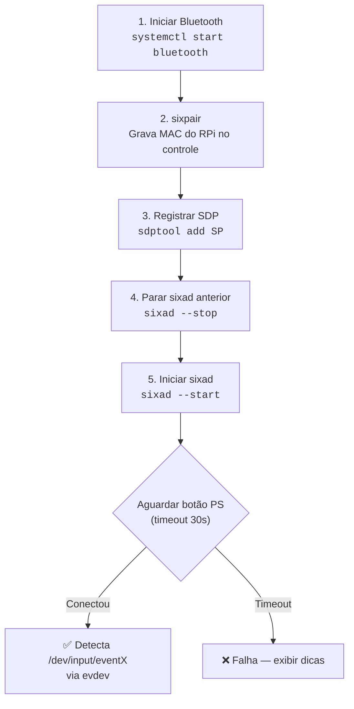
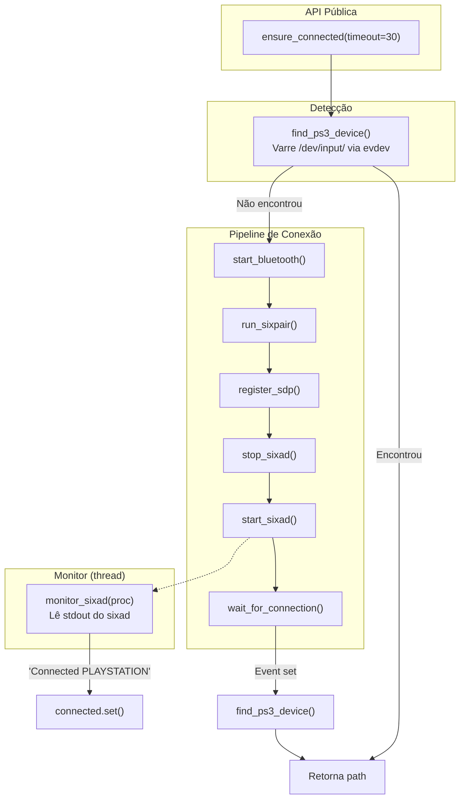
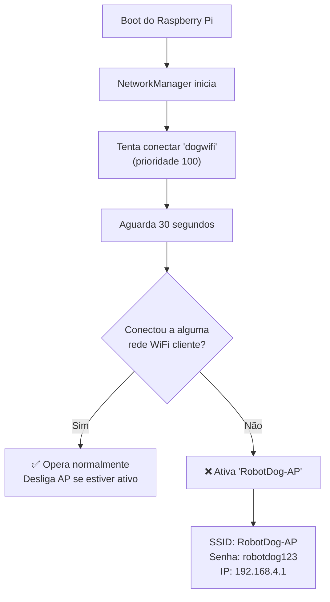

# Configuração do Sistema - Raspberry Pi 4 + Controle PS3

> Documentação das configurações realizadas no Raspberry Pi 4 para viabilizar o controle do robô quadrúpede via gamepad PS3 original (Sony) por Bluetooth, incluindo o sistema de fallback de rede WiFi e demais ajustes de infraestrutura.

---

## Sumário

1. [Contexto e Decisões de Projeto](#1-contexto-e-decisões-de-projeto)
2. [Bluetooth e sixad — Por que não usar bluetoothctl](#2-bluetooth-e-sixad--por-que-não-usar-bluetoothctl)
3. [Pipeline de Conexão do Controle PS3](#3-pipeline-de-conexão-do-controle-ps3)
4. [A Biblioteca `connect_ps3_control.py`](#4-a-biblioteca-connect_ps3_controlpy)
5. [Integração com Scripts do Robô](#5-integração-com-scripts-do-robô)
6. [Sistema de Fallback WiFi → Access Point](#6-sistema-de-fallback-wifi--access-point)
7. [Configuração do I2C (PCA9685)](#7-configuração-do-i2c-pca9685)
8. [Python venv + sudo — Contornando o PEP 668](#8-python-venv--sudo--contornando-o-pep-668)
9. [Serviços systemd Configurados](#9-serviços-systemd-configurados)
10. [Troubleshooting Consolidado](#10-troubleshooting-consolidado)

---

## 1. Contexto e Decisões de Projeto

O Raspberry Pi 4 com Debian Trixie (BlueZ 5.82+) apresenta várias incompatibilidades com hardware legado como o controle PS3 e restrições modernas de segurança do Python. As configurações documentadas aqui resolvem três problemas centrais:

| Problema | Causa | Solução adotada |
|----------|-------|-----------------|
| PS3 não conecta via Bluetooth nativo | BlueZ 5.82+ exige autenticação que o PS3 não suporta | Uso do **sixad** com `--compat` no bluetoothd |
| Robô pode operar sem rede WiFi disponível | Cenário de campo sem infraestrutura | **Fallback automático** para modo Access Point |
| `pip install` bloqueado pelo sistema | PEP 668 (`externally-managed-environment`) | **Ambiente virtual** (venv) com `sudo` apontando para o Python do venv |

> ⚠️ **Controles clone** (Shanwan/Panhai) foram testados mas **não funcionam via Bluetooth** com BlueZ 5.82+. O clone funciona apenas via cabo USB. Todo o sistema foi projetado para o controle PS3 **original Sony**.

---

## 2. Bluetooth e sixad — Por que não usar bluetoothctl

O controle PS3 utiliza o protocolo **HID sobre L2CAP** com um mecanismo de autenticação proprietário da Sony. O stack Bluetooth moderno do Linux (BlueZ 5.x) removeu o suporte ao perfil **SDP legado** e exige autenticação Secure Simple Pairing (SSP), que o PS3 não implementa.

### O que é o sixad

O **sixad** (SixAxis Daemon) é um daemon que:

1. **Bypassa a autenticação do BlueZ** — aceita a conexão L2CAP do controle diretamente
2. **Registra o dispositivo em `/dev/input/`** — cria um `eventX` padrão evdev
3. **Gerencia a reconexão** — monitora desconexões e reaceita automaticamente

### Configuração necessária do bluetoothd

Para que o sixad funcione, o `bluetoothd` precisa rodar com a flag `--compat`, que reabilita o servidor SDP legado. Isso é feito via override do systemd:

**Arquivo**: `/etc/systemd/system/bluetooth.service.d/override.conf`
```ini
[Service]
ExecStart=
ExecStart=/usr/libexec/bluetooth/bluetoothd --compat --noplugin=sap
```

| Flag | Função |
|------|--------|
| `--compat` | Habilita interface SDP legada necessária para o sixad registrar perfis |
| `--noplugin=sap` | Desabilita o plugin SAP (SIM Access Profile), evitando erros no log |

A linha `ExecStart=` vazia é **obrigatória** para limpar o valor anterior antes de redefinir.

```bash
sudo systemctl daemon-reload
sudo systemctl enable bluetooth
sudo systemctl start bluetooth
```

### Primeiro emparelhamento (sixpair via USB)

Na primeira vez, o controle precisa ser conectado **via cabo USB** para que o `sixpair` grave o endereço MAC do Bluetooth do Raspberry Pi na memória interna do controle:

```bash
sudo ./sixpair
# Saída:
# Current Bluetooth master: xx:xx:xx:xx:xx:xx
# Setting master bd_addr to d8:3a:dd:1c:52:03
```

Após esse passo, o controle sempre tentará conectar ao Raspberry Pi quando o botão PS for pressionado — não é necessário repetir o `sixpair`.

---

## 3. Pipeline de Conexão do Controle PS3

O processo completo de conexão segue 5 etapas sequenciais:



| Etapa | Comando | Pode falhar silenciosamente? |
|-------|---------|------------------------------|
| Bluetooth | `systemctl start bluetooth` | Não — aborta se falhar |
| sixpair | `./sixpair` | **Sim** — dispensável se já emparelhou antes |
| SDP | `sdptool add SP` | **Sim** — avisa mas continua |
| Stop sixad | `sixad --stop` | **Sim** — apenas garante estado limpo |
| Start sixad | `sixad --start` | Não — aborta se binário não encontrado |

---

## 4. A Biblioteca `connect_ps3_control.py`

O arquivo [connect_ps3_control.py](../lib/connect_ps3_control.py) encapsula todo o pipeline de conexão em uma API reutilizável.

### Arquitetura do módulo



### Função principal: `ensure_connected()`

A função segue uma lógica de **detecção antes de conexão** (fail-fast):

```python
def ensure_connected(timeout=30):
    # 1. Verifica se já está conectado
    device = find_ps3_device()
    if device:
        return device  # Retorno imediato — sem overhead

    # 2. Executa pipeline completo de conexão
    check_root()
    start_bluetooth()
    run_sixpair()
    register_sdp()
    stop_sixad()
    start_sixad()

    # 3. Aguarda o botão PS ser pressionado
    wait_for_connection(timeout)

    # 4. Busca o dispositivo criado pelo sixad
    for _ in range(10):         # Polling por até 5s
        device = find_ps3_device()
        if device:
            return device
        time.sleep(0.5)

    return None  # Falha
```

### Detecção via evdev

A função `find_ps3_device()` varre todos os dispositivos em `/dev/input/` usando a biblioteca `evdev`, procurando por nomes que contenham `"PLAYSTATION"`, `"SIXAXIS"` ou `"PS3"`:

```python
def find_ps3_device():
    from evdev import InputDevice, list_devices
    for path in list_devices():
        dev = InputDevice(path)
        name = dev.name.upper()
        if "PLAYSTATION" in name or "SIXAXIS" in name or "PS3" in name:
            return path      # Ex.: "/dev/input/event5"
    return None
```

Isso elimina a necessidade de hardcodar o caminho do dispositivo (que muda entre reinicializações).

### Monitor assíncrono do sixad

O `sixad --start` roda como processo filho com stdout capturado. Uma **thread daemon** (`monitor_sixad`) lê cada linha da saída e:

- Imprime no terminal com prefixo colorido `sixad>`
- Detecta a string `"Connected"` + `"PLAYSTATION"` → sinaliza o `threading.Event`
- Detecta `"error"` ou `"failed"` → exibe como warning

### Busca de binários com fallback

A função `find_binary()` busca executáveis (`sixpair`, `sixad`) em múltiplos caminhos, tratando instalações não-padrão:

```python
def find_binary(name, extra_paths=None):
    paths = (extra_paths or []) + [
        f"/usr/sbin/{name}",
        f"/usr/bin/{name}",
        f"/usr/local/bin/{name}",
        os.path.expanduser(f"~/{name}"),
        f"./{name}",
    ]
    # Retorna o primeiro caminho que existe e é executável
```

Isso é necessário porque o `sixad`/`sixpair` compilado a partir do fonte pode ser instalado em diretórios diferentes dependendo do sistema.

---

## 5. Integração com Scripts do Robô

### Como os scripts usam o controle

O arquivo [ps3_leg_flexion.py](../test/leg_test/v3/ps3_leg_flexion.py) demonstra o padrão de integração:

```python
# 1. Adiciona o diretório lib/ ao path
_ROOT = os.path.abspath(os.path.join(_HERE, "..", "..", ".."))
sys.path.insert(0, os.path.join(_ROOT, "lib"))

# 2. Importa as bibliotecas
from ps3_control import PS3Controller
from connect_ps3_control import ensure_connected

# 3. Garante conexão (automática)
device_path = ensure_connected(timeout=30)

# 4. Inicializa o controlador
ctrl = PS3Controller(deadzone=6, normalize=True)
ctrl.connect(timeout=5.0)

# 5. Registra callbacks para botões
ctrl.on_button("BTN_SOUTH", on_south)    # Cruz (×)
ctrl.on_button("BTN_NORTH", on_north)    # Triângulo (△)
ctrl.on_button("BTN_START", on_start)    # Start

# 6. Loop principal lê os analógicos
ctrl.start()
while running:
    eixo_y = ctrl.axis("ABS_Y")    # Analógico esquerdo Y
    eixo_x = ctrl.axis("ABS_X")    # Analógico esquerdo X
    # ... aplica IK e move servos
```

### Mapeamento de controles no `ps3_leg_flexion.py`

| Entrada | Tipo | Função |
|---------|------|--------|
| Analógico esq. Y (`ABS_Y`) | Eixo | Sobe/desce todas as pernas (Z) |
| Analógico esq. X (`ABS_X`) | Eixo | Desloca frente/trás (X ± 30 mm) |
| Cruz × (`BTN_SOUTH`) | Botão | Posição de descanso (sleep) |
| Triângulo △ (`BTN_NORTH`) | Botão | Posição padrão (default) |
| Start (`BTN_START`) | Botão | Encerrar programa |

### Deadzone do analógico

Para evitar que ruído do centro do analógico cause micro-movimentos, é aplicada uma **zona morta (deadzone)** de 10%:

```python
def _deadzone(val, dz=0.10):
    if abs(val) < dz:
        return 0.0
    sign = 1.0 if val > 0 else -1.0
    return sign * (abs(val) - dz) / (1.0 - dz)
```

O valor é **reescalado** após remover a deadzone, garantindo que a faixa útil continua sendo [0, 1] em vez de [0.1, 1].

### Scripts que utilizam `ensure_connected()`

| Script | Caminho |
|--------|---------|
| Flexão com PS3 | [ps3_leg_flexion.py](../test/leg_test/v3/ps3_leg_flexion.py) |
| Teste 4-bar com PS3 | [4bars_ps3.py](../test/leg_test/v1/4bars_ps3.py) |
| Teste 4-bar + GY-521 | [4bars_ps3_gy521.py](../test/leg_test/v1/4bars_ps3_gy521.py) |
| Teste BLE servo 180° | [ble_servo_control_test_180.py](../test/general_test/ble_servo_control_test_180.py) |
| Teste BLE servo 360° | [ble_servo_control_test_360.py](../test/general_test/ble_servo_control_test_360.py) |
| Teste BLE controle | [ble_control_test.py](../test/general_test/ble_control_test.py) |

---

## 6. Sistema de Fallback WiFi → Access Point

O robô opera em cenários de campo onde nem sempre há rede WiFi disponível. Para garantir que o operador sempre possa acessar o Raspberry Pi via SSH, foi implementado um **sistema de fallback automático** que alterna entre modo cliente WiFi e Access Point.

### Arquitetura do fallback



### Componentes

#### 1. Rede WiFi principal (modo cliente)

```bash
sudo nmcli dev wifi connect "dogwifi" password "dogwifi13579"
sudo nmcli connection modify "dogwifi" connection.autoconnect yes
sudo nmcli connection modify "dogwifi" connection.autoconnect-priority 100
```

A **prioridade 100** garante que esta rede será sempre preferida sobre outras redes salvas.

#### 2. Perfil de Access Point

O NetworkManager gerencia o modo AP diretamente, sem necessidade de `hostapd`:

```bash
sudo nmcli connection add \
  type wifi ifname wlan0 con-name "RobotDog-AP" \
  autoconnect no \
  wifi.mode ap wifi.ssid "RobotDog-AP" \
  wifi-sec.key-mgmt wpa-psk wifi-sec.psk "robotdog123" \
  ipv4.method shared ipv4.addresses 192.168.4.1/24
```

| Parâmetro | Valor | Motivo |
|-----------|-------|--------|
| `autoconnect no` | Não liga sozinho | Só o script de fallback deve ativá-lo |
| `wifi.mode ap` | Access Point | Raspberry Pi se torna o roteador |
| `ipv4.method shared` | DHCP + NAT | Clientes recebem IP via DHCP automaticamente |
| `ipv4.addresses` | `192.168.4.1/24` | IP fixo e previsível para SSH |

#### 3. Script de fallback (`/usr/local/bin/wifi-fallback.sh`)

```bash
#!/bin/bash
TIMEOUT=30
LOG="/var/log/wifi-fallback.log"

echo "[$(date)] Verificando conexão WiFi..." >> $LOG
sleep $TIMEOUT

# Verifica se está conectado como cliente (ignora o próprio AP)
CONNECTED=$(nmcli -t -f ACTIVE,SSID dev wifi | grep "^yes" | grep -v "RobotDog-AP")

if [ -z "$CONNECTED" ]; then
    echo "[$(date)] Sem conexão WiFi. Ativando modo AP..." >> $LOG
    sudo nmcli connection up "RobotDog-AP"
else
    echo "[$(date)] Conectado: $CONNECTED" >> $LOG
    sudo nmcli connection down "RobotDog-AP" 2>/dev/null
fi
```

**Pontos-chave do script**:
- **Sleep de 30s**: dá tempo para o NetworkManager tentar todas as redes salvas
- **Filtro `grep -v "RobotDog-AP"`**: evita falso positivo quando o próprio AP está ativo
- **Desliga AP se conectou**: garante que o WiFi cliente tem prioridade

#### 4. Serviço systemd

O script roda automaticamente no boot via serviço oneshot:

**Arquivo**: `/etc/systemd/system/wifi-fallback.service`
```ini
[Unit]
Description=WiFi Fallback para modo AP
After=NetworkManager.service
Wants=NetworkManager-wait-online.service

[Service]
Type=oneshot
ExecStart=/usr/local/bin/wifi-fallback.sh
RemainAfterExit=yes

[Install]
WantedBy=multi-user.target
```

| Diretiva | Função |
|----------|--------|
| `After=NetworkManager.service` | Só executa depois que o NM está rodando |
| `Wants=NetworkManager-wait-online.service` | Espera o NM estar pronto para operar |
| `Type=oneshot` | Executa uma vez e termina |
| `RemainAfterExit=yes` | systemd considera o serviço "ativo" mesmo após terminar |

#### Verificar logs

```bash
cat /var/log/wifi-fallback.log
```

---

## 7. Configuração do I2C (PCA9685)

O barramento I2C é usado para comunicar com o driver PCA9685 (16 canais PWM) que controla todos os servos.

### Habilitação

```bash
sudo raspi-config
# Interface Options → I2C → Enable
sudo reboot
```

### Verificação

```bash
sudo apt install i2c-tools
i2cdetect -y 1
# O endereço 0x40 deve aparecer na matriz
```

### Wiring

| Raspberry Pi | PCA9685 | Função |
|---|---|---|
| 3V3 (Pin 1) | VCC | Alimentação lógica |
| GND | GND | Referência comum |
| SCL (Pin 5) | SCL | Clock I2C |
| SDA (Pin 3) | SDA | Dados I2C |

> ⚠️ A alimentação dos motores (5V, 2A+) deve ser conectada nos **terminais de potência** (bloco verde) do PCA9685, **nunca** na linha lógica 3.3V.

---

## 8. Python venv + sudo — Contornando o PEP 668

A partir do Debian Bookworm/Trixie, o `pip install` em nível de sistema é **bloqueado** pelo PEP 668 (`externally-managed-environment`). A solução adotada é um ambiente virtual (venv).

### O problema com `sudo`

Scripts que acessam hardware (Bluetooth, I2C, GPIO) precisam de `sudo`. Porém, `sudo python3` usa o Python do **sistema**, ignorando o venv e suas bibliotecas:

```bash
# ❌ ERRADO — usa Python do sistema, não encontra evdev, adafruit, etc.
sudo python3 script.py

# ✅ CORRETO — usa o Python do venv com sudo
sudo env/bin/python3 script.py

# ✅ ALTERNATIVO — preserva PYTHONPATH para imports relativos
sudo PYTHONPATH=. env/bin/python3 script.py
```

### Setup completo

```bash
sudo apt install python3-pip python3-venv python3-full
python3 -m venv env
source env/bin/activate
pip install -r requirements.txt
```

---

## 9. Serviços systemd Configurados

Resumo de todos os serviços customizados no Raspberry Pi:

| Serviço | Tipo | Habilitado no boot | Função |
|---------|------|--------------------|--------|
| `bluetooth.service` | Override | ✅ `enable` | Bluetooth com `--compat` para sixad |
| `sixad.service` | Padrão (sixad) | ✅ `enable` | Aceita conexões PS3 automaticamente |
| `wifi-fallback.service` | Custom (oneshot) | ✅ `enable` | Fallback WiFi → AP após 30s sem rede |

### Comandos úteis

```bash
# Status dos serviços
sudo systemctl status bluetooth sixad wifi-fallback

# Reiniciar após mudanças no override.conf
sudo systemctl daemon-reload
sudo systemctl restart bluetooth

# Verificar logs do sixad
journalctl -u sixad -f

# Verificar logs do WiFi fallback
cat /var/log/wifi-fallback.log
```

---

## 10. Troubleshooting Consolidado

### Bluetooth / PS3

| Erro | Causa | Solução |
|------|-------|---------|
| `ModuleNotFoundError: No module named 'evdev'` | `sudo` usando Python do sistema | `sudo env/bin/python3 script.py` |
| `unable to connect to sdp session` | `bluetoothd` sem `--compat` | Verificar `override.conf`, reiniciar bluetooth |
| `HID create error 110 (Connection timed out)` | Controle sem bateria ou fora de alcance | Pressionar botão PS, verificar carga |
| `HID create error 107 (Transport endpoint not connected)` | Bluetooth inativo | `sudo systemctl start bluetooth` |
| `Authentication Failed (0x05)` | BlueZ tentando autenticar o PS3 | Usar sixad, não `bluetoothctl` |
| `sixpair: Unable to retrieve local bd_addr` | Bluetooth parado ao rodar sixpair | Iniciar bluetooth antes do sixpair |
| Clone Shanwan não conecta via BT | Firmware incompatível com BlueZ 5.82+ | Usar PS3 original ou cabo USB |

### I2C / PCA9685

| Erro | Causa | Solução |
|------|-------|---------|
| `OSError: [Errno 121] Remote I/O error` | Fiação I2C com mau contato | Verificar SDA, SCL, VCC 3.3V e GND |
| `ValueError: No I2C device at address: 0x40` | PCA9685 não detectado | `i2cdetect -y 1` — endereço 0x40 deve aparecer |

### WiFi / Rede

| Problema | Causa | Solução |
|----------|-------|---------|
| AP não ativa no boot | Serviço não habilitado | `sudo systemctl enable wifi-fallback.service` |
| Não consigo conectar no AP | Senha incorreta | Senha: `robotdog123`, IP do RPi: `192.168.4.1` |
| AP ativa mesmo com WiFi disponível | Timeout curto ou rede lenta | Aumentar `TIMEOUT` no script de fallback |
