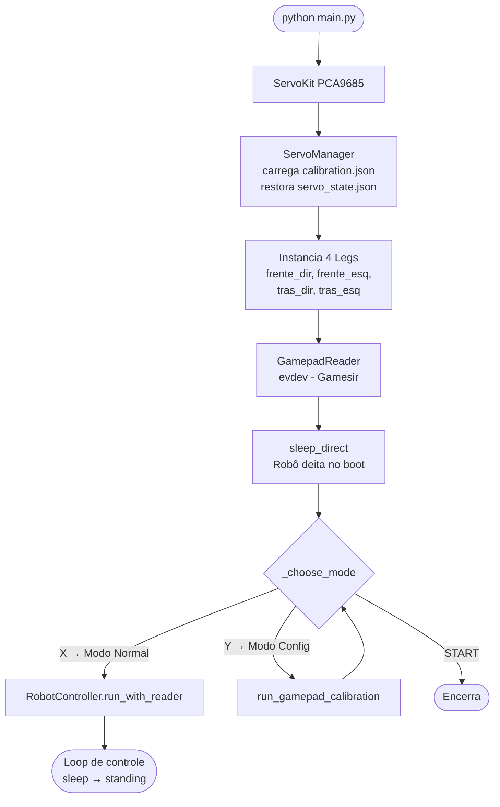
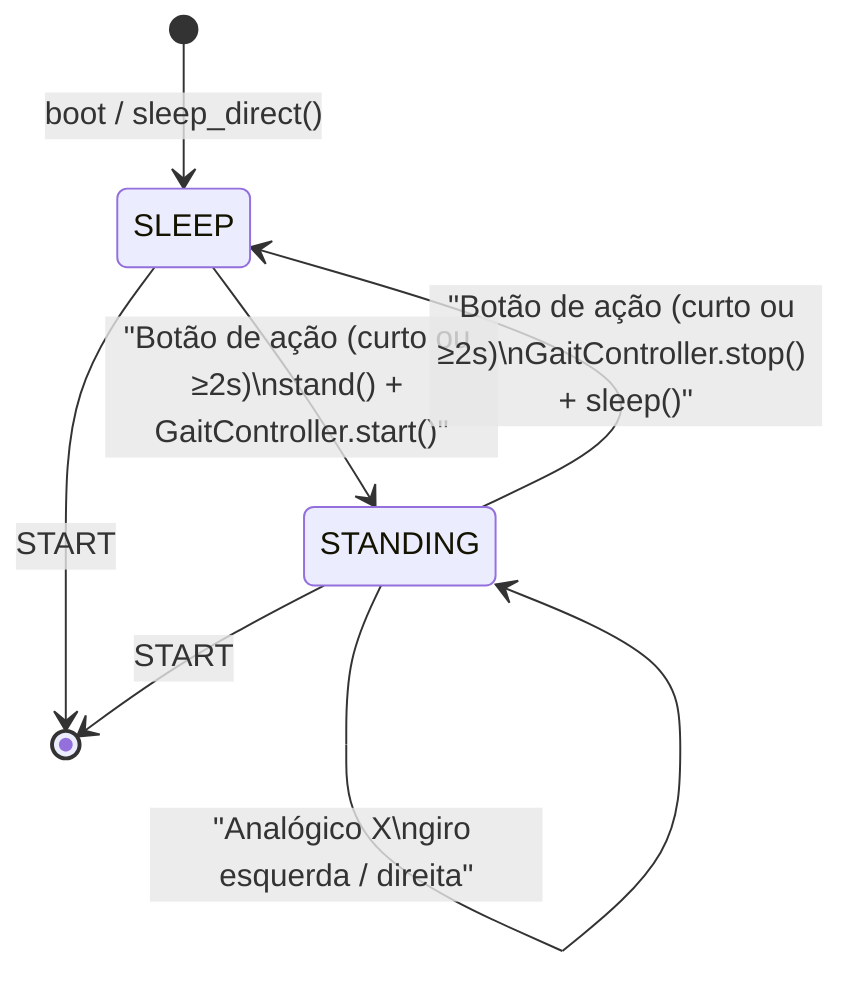
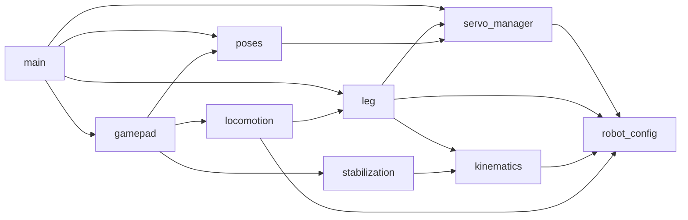
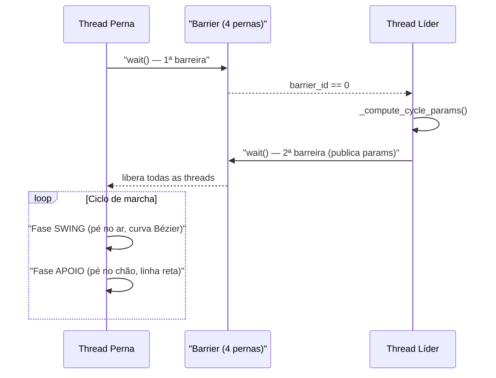
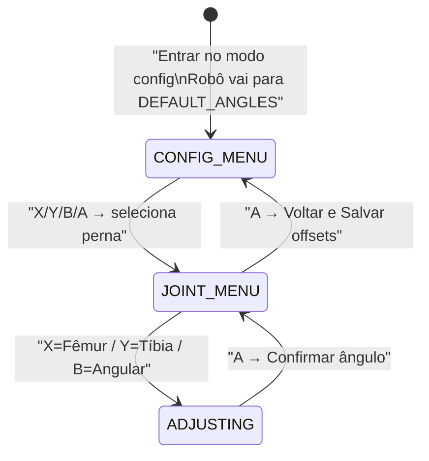

# 🐾 Robot-Dog-Maua — Robô Quadrúpede

Robô cão quadrúpede desenvolvido no **Instituto Mauá de Tecnologia**, controlado por **Raspberry Pi 4**, com 12 servos, cinemática inversa e controle via gamepad.

---

## Sumário

- [Hardware Necessário](#hardware-necessário)
- [Estrutura do Projeto](#estrutura-do-projeto)
- [Arquitetura e Fluxo de Execução](#arquitetura-e-fluxo-de-execução)
- [Mapeamento de Hardware](#mapeamento-de-hardware)
- [Módulos em Detalhe](#módulos-em-detalhe)
- [Controles do Gamepad](#controles-do-gamepad)
- [Como Rodar](#como-rodar)
- [Como Calibrar os Servos](#como-calibrar-os-servos)
- [Scripts Auxiliares](#scripts-auxiliares)

---

## Hardware Necessário

| Componente | Modelo / Especificação |
|---|---|
| Computador de bordo | Raspberry Pi 4 |
| Driver de servos | PCA9685 (16 canais, I2C) |
| Servos de fêmur e tíbia | 8× servo padrão |
| Servos angulares (hip) | 4× servo padrão |
| IMU (inercial) | MPU6050 (acelerômetro + giroscópio, I2C) |
| Controle | Gamesir (ou compatível Xbox/gamepad via evdev) |

### Geometria das Pernas (mm)

Cada perna tem dois segmentos rígidos:

```
    Ombro
      │
   [Fêmur]  ← 120 mm
      │
   Joelho
      │
   [Tíbia]  ← 130 mm
      │
     Pé
```

- **Fêmur** (`upper_leg = 120 mm`): segmento superior, controlado pelo servo fêmur.
- **Tíbia** (`lower_leg = 130 mm`): segmento inferior, controlado pelo servo tíbia.
- **Angular** (`hip abduction`): servo que inclina a perna lateralmente (corrige roll).
- **Alcance máximo**: 220 mm a partir do ombro.
- **Referencial**: Z negativo = abaixo do corpo; X positivo = frente do robô.

---

## Estrutura do Projeto

```
main/
├── main.py                        ← Ponto de entrada (inicialização e seleção de modo)
│
├── configs/
│   ├── robot_config.py            ← Toda a configuração de hardware, geometria e marcha
│   └── calibration.json           ← Offsets de calibração persistidos (gerado automaticamente)
│
├── core/
│   ├── kinematics.py              ← Cinemática Inversa (IK), interpolação, curvas Bézier
│   ├── servo_manager.py           ← Gerenciamento centralizado dos 12 servos
│   └── leg.py                     ← Abstração de uma perna (IK + rampa + ciclo de marcha)
│
├── motion/
│   ├── poses.py                   ← Transições de pose: stand(), sleep(), sleep_direct()
│   ├── locomotion.py              ← GaitController: orquestra threads de marcha das 4 pernas
│   └── stabilization.py           ← Estabilização roll/pitch via MPU6050 + Filtro de Kalman
│
├── input/
│   ├── gamepad.py                 ← GamepadReader (evdev) + RobotController (máquina de estados)
│   └── gamepad_calibration.py    ← Modo interativo de calibração via gamepad
│
└── auxiliar_funcs/                ← Scripts legados / testes de subsistemas
    ├── leg_test.py                ← Shim de compatibilidade para API antiga de pernas
    ├── leg_flexion.py             ← Testes de flexão isolada de perna
    └── stabilization.py           ← Testes isolados de estabilização
```

### Mapa de Responsabilidades

| Módulo | Responsabilidade |
|---|---|
| `configs/robot_config.py` | Fonte única de verdade para canais, ângulos, geometria e poses |
| `core/servo_manager.py` | Escreve ângulos nos servos, aplica calibração, persiste estado |
| `core/kinematics.py` | Calcula ângulos de fêmur e tíbia a partir de coordenadas (x, z) |
| `core/leg.py` | Une IK + rampa + ciclo de marcha em uma única classe parametrizada |
| `motion/poses.py` | Sequências suaves de stand/sleep (múltiplas etapas) |
| `motion/locomotion.py` | Threads de marcha, sincronização, misturador diferencial |
| `motion/stabilization.py` | Loop de controle roll+pitch com filtro de Kalman e MPU6050 |
| `input/gamepad.py` | Leitura de eventos evdev + máquina de estados sleep↔standing |
| `input/gamepad_calibration.py` | Ajuste fino de offsets de servo via gamepad |

---

## Arquitetura e Fluxo de Execução

### Inicialização (`main.py`)



### Máquina de Estados do `RobotController`



### Dependências entre Módulos



### Ciclo de Marcha por Perna

Cada perna executa em sua própria thread um ciclo de **Trot** (marcha diagonal):



**Pares diagonais em fase oposta (Trot):**

| Par Diagonal A | Par Diagonal B |
|:---:|:---:|
| `frente_dir` ↔ `tras_esq` | `frente_esq` ↔ `tras_dir` |
| `phase = swing_first` | `phase = stance_first` |

---

## Mapeamento de Hardware

### Canais PCA9685 → Servo → Perna

> Atualizado em 12/09/2026 — Placa v4

| Canal | Servo | Perna | Chave no código |
|:---:|---|---|---|
| 0 | Tíbia | Frontal Direita | `frente_tibia_dir` |
| 1 | Angular | Frontal Direita | `frente_angular_dir` |
| 2 | Fêmur | Frontal Direita | `frente_femur_dir` |
| 5 | Tíbia | Frontal Esquerda | `frente_tibia_esq` |
| 6 | Angular | Frontal Esquerda | `frente_angular_esq` |
| 7 | Fêmur | Frontal Esquerda | `frente_femur_esq` |
| 8 | Fêmur | Traseira Esquerda | `tras_femur_esq` |
| 9 | Angular | Traseira Esquerda | `tras_angular_esq` |
| 10 | Tíbia | Traseira Esquerda | `tras_tibia_esq` |
| 13 | Fêmur | Traseira Direita | `tras_femur_dir` |
| 14 | Angular | Traseira Direita | `tras_angular_dir` |
| 15 | Tíbia | Traseira Direita | `tras_tibia_dir` |

### Faixas dos Servos Angulares

| Perna | Canal | Mín | Máx | Default |
|---|:---:|:---:|:---:|:---:|
| Frontal Direita | 1 | 70° | 120° | 100° |
| Frontal Esquerda | 6 | 90° | 135° | 110° |
| Traseira Direita | 14 | 90° | 135° | 102° |
| Traseira Esquerda | 9 | 70° | 120° | 100° |

### Convenção de Nomes

Os nomes dos servos seguem o padrão: `{posição}_{articulação}_{lado}`

- **posição**: `frente` ou `tras`
- **articulação**: `femur`, `tibia`, ou `angular`
- **lado**: `dir` (direita) ou `esq` (esquerda)

Exemplo: `tras_angular_esq` = servo angular da perna traseira esquerda.

---

## Módulos em Detalhe

### `configs/robot_config.py` — Configuração Central

Fonte única de verdade para todo o hardware e parâmetros de marcha. **Qualquer ajuste de ângulo, canal ou velocidade deve ser feito apenas aqui.**

Constantes principais:

| Constante | Descrição |
|---|---|
| `SERVO_CHANNELS` | Mapeamento nome → canal PCA9685 |
| `DEFAULT_ANGLES` | Ângulos de referência para calibração (posição neutra) |
| `LEG_CONFIG` | Configuração individual de cada perna (mirror, phase, ang_min/max) |
| `GAIT_PARAMS` | Parâmetros de marcha por grupo (z_apoio, z_swing, x_frente, etc.) |
| `POSE_STAND` | Ângulos absolutos para a pose em pé |
| `POSE_SLEEP` | Ângulos absolutos para a pose deitada |
| `POSE_SLEEP_STRUCT` | Pose intermediária antes de deitar (evita bater no chão) |
| `SMOOTH_N_STEPS` | Número de passos da interpolação suave (padrão: 60) |
| `SMOOTH_DELAY` | Delay entre passos da interpolação (padrão: 0.02 s) |

---

### `core/servo_manager.py` — `ServoManager`

Gerencia os 12 servos via `adafruit_servokit`. É a camada que separa a lógica de alto nível (IK, poses) do hardware.

**Responsabilidades:**
- Inicializar os servos mapeando nome → objeto `kit.servo[canal]`
- Carregar offsets de calibração de `configs/calibration.json`
- Restaurar o último ângulo de cada servo de `configs/servo_state.json` no boot
- Escrever ângulos com `set_angle(nome, graus)` — aplica offset e limita a `[0°, 180°]`
- Executar movimentação suave com `smooth_move(targets)` usando **Smootherstep**

**Smootherstep (C²):** curva de interpolação com velocidade zero nas extremidades, eliminando picos de corrente e solavancos mecânicos:

```
f(t) = 6t⁵ − 15t⁴ + 10t³
```

**Arquivos gerados automaticamente:**

| Arquivo | Conteúdo |
|---|---|
| `configs/calibration.json` | Offsets de cada servo em graus (gerado pelo modo de calibração) |
| `configs/servo_state.json` | Ângulo atual de cada servo (salvo ao final de `smooth_move`) |

---

### `core/kinematics.py` — Cinemática Inversa

Implementa a matemática que converte uma **posição do pé** em coordenadas (x, z) para os **ângulos dos servos** de fêmur e tíbia.

#### Cinemática Inversa (IK)

```
   Ombro
     │ ← θ_fêmur
  [Fêmur] (120mm)
     │
  Joelho
     │ ← θ_tíbia
  [Tíbia] (130mm)
     │
    Pé → posição alvo (x, z)
```

A função `ik(x, z)` resolve geometricamente os ângulos usando a lei dos cossenos. A função `ik_to_servo_angles(x, z, mirror)` converte para graus e aplica o espelhamento para pernas esquerdas (`180° − θ`).

#### Curva de Bézier Cúbica

Usada na **fase de swing** para o pé traçar uma trajetória suave no ar:

```
B(t) = (1−t)³·P0 + 3(1−t)²t·P1 + 3(1−t)t²·P2 + t³·P3
```

- **P0**: decolagem (chão, atrás)
- **P1**, **P2**: pontos de controle (definem o arco)
- **P3**: pouso (chão, frente)

---

### `core/leg.py` — `Leg`

Abstração de uma perna genérica. Substitui as 4 funções quase-idênticas que existiam antes (~640 linhas) por uma única classe parametrizada (~80 linhas de lógica real).

**Parâmetros de configuração** (via `LEG_CONFIG` em `robot_config.py`):

| Parâmetro | Descrição |
|---|---|
| `mirror` | `True` para pernas esquerdas (inverte ângulos: 180° − θ) |
| `group` | `"frente"` ou `"tras"` — define os parâmetros de marcha |
| `phase` | `"swing_first"` ou `"stance_first"` — fase inicial do ciclo |
| `ang_min`, `ang_max` | Faixa do servo angular para esta perna |
| `angular_fixed_angle` | Ângulo do angular quando `use_angular=False` |
| `walk_scale`, `turn_scale` | Escala da amplitude ao andar / girar |

**Métodos principais:**

| Método | Descrição |
|---|---|
| `move_to(x, z)` | Move o pé para (x, z) mm via IK |
| `ramp_to_start(stop_event)` | Rampa suave até a posição inicial de marcha |
| `run_gait_loop(stop_event, ...)` | Loop contínuo de swing + apoio |

---

### `motion/poses.py` — Transições de Pose

Implementa as transições suaves entre poses predefinidas. As sequências em múltiplas etapas existem para **evitar picos de corrente** e garantir que os servos angulares não colidam com o chão.

| Função | Sequência |
|---|---|
| `stand(servo_mgr)` | 1. Fêmures/tíbias → posição de pé; 2. Angulares → neutro |
| `sleep(servo_mgr)` | 1. Fêmures/tíbias → intermediário; 2. Angulares → deitado; 3. Fêmures/tíbias → final |
| `sleep_direct(servo_mgr)` | 1. Fêmures/tíbias → final (movimento conjunto); 2. Angulares → deitado |
| `transition_to(servo_mgr, pose)` | Transição suave para qualquer pose (dicionário arbitrário) |

> `sleep_direct` é usada no boot porque os servos já estão em repouso, sem risco de bater no chão.

---

### `motion/locomotion.py` — `GaitController`

Orquestra a locomoção das 4 pernas via **threads paralelas** sincronizadas por uma barreira.

#### Misturador Diferencial (Tank/Skid Steer)

O giro é implementado com velocidade diferencial por lado (como um tanque):

```
v_esquerdo = velocidade_frente + yaw
v_direito  = velocidade_frente − yaw
```

- `yaw > 0` → girar à direita (lado direito vai para trás, esquerdo para frente)
- Permite giro no próprio eixo quando `yaw` alto e `frente ≈ 0`

#### Barreira de Sincronização (Double-Barrier)

Para garantir que pernas diagonais **sempre recebam os mesmos parâmetros no mesmo ciclo**, usa-se um protocolo de duas barreiras:

1. **1ª barreira**: todas as 4 pernas terminam o ciclo anterior juntas
2. A **thread líder** (a que chegou primeira) calcula os novos parâmetros
3. **2ª barreira**: libera todas somente após a publicação dos novos parâmetros

Isso elimina a dessincronização acumulada por jitter de I2C/GIL.

#### Rampa de Velocidade

Para evitar solavancos ao inverter a direção ou iniciar giros, a velocidade de cada lado é alterada gradualmente com um passo máximo de `±0.35` por ciclo.

---

### `motion/stabilization.py` — Estabilização IMU

Lê o **MPU6050** via I2C e compensa a inclinação do robô em tempo real.

#### Montagem do IMU

```
+X → FRENTE do robô
+Y → BAIXO  (ay = −1g quando nivelado)
+Z → ESQUERDA
```

#### Filtro de Kalman 1-D

Funde os dados do acelerômetro (ângulo absoluto, ruidoso) com o giroscópio (taxa de variação, sem drift) para obter um ângulo estável:

```
Predição:  ângulo += (taxa_gyro − bias) × dt
Correção:  ângulo += K × (ângulo_accel − ângulo_predito)
```

#### Compensação de Roll e Pitch

| Eixo | Atuação |
|---|---|
| **Roll** (inclinação lateral) | Ajusta os 4 servos **angulares** proporcionalmente ao erro |
| **Pitch** (inclinação frontal) | Ajusta o Z das pernas dianteiras e traseiras via IK |

#### Modos Disponíveis

| Função | Uso |
|---|---|
| `stabilize(robot_leg, stop_event)` | Estabilização completa (sem marcha — robô parado) |
| `stabilize_angular(stop_event, robot_leg)` | Apenas roll, em paralelo com a locomoção |
| `stabilize_full_walking(stop_event, robot_leg, shared_state)` | Roll + pitch durante a marcha (atualiza `shared_state`) |

> ⚠️ A estabilização durante a marcha (`stabilize_full_walking`) está **desativada** no código atual (comentada em `gamepad.py`). Pode ser reativada removendo o comentário no método `_run_toggle`.

---

### `input/gamepad.py` — Leitura de Gamepad e Controle

#### `GamepadReader`

Detecta automaticamente o primeiro gamepad disponível via `evdev` (Linux). Normaliza os eixos analógicos para `[−1.0, 1.0]` com **zona morta de 15%**.

#### `RobotController`

Máquina de estados que reage aos eventos do gamepad:

- **Estado `SLEEP`**: robô deitado, aguardando comando.
- **Estado `STANDING`**: robô em pé, locomoção ativa.
- **Transição**: botão de ação pressionado (curto < 2s ou longo ≥ 2s).

O `shared_state` é um dicionário compartilhado entre as threads de locomoção e estabilização:

```python
shared_state = {
    "speed":            0,       # 0.0 a 1.0 — intensidade do movimento
    "direction":        1,       # 1 = frente, -1 = trás
    "yaw":              0.0,     # -1.0 a 1.0 — giro
    "z_pitch_frente":   0.0,     # ajuste de Z (mm) das pernas dianteiras pelo IMU
    "z_pitch_tras":     0.0,     # ajuste de Z (mm) das pernas traseiras pelo IMU
    "imu_roll_offset":  0.0,     # offset de roll capturado no boot
    "imu_pitch_offset": 0.0,     # offset de pitch capturado no boot
}
```

---

### `input/gamepad_calibration.py` — Calibração Interativa

Modo de 3 níveis de menu navegado pelo gamepad para ajustar os offsets de cada servo individualmente.

#### Fluxo de Estados



**Como os offsets são calculados:**

```
offset = ângulo_ajustado − DEFAULT_ANGLE
```

Os offsets são salvos em `configs/calibration.json` e aplicados automaticamente pelo `ServoManager.set_angle()` em **todas** as operações (IK, marcha, poses).

---

## Controles do Gamepad

### Modo Normal (Operação)

| Entrada | Ação |
|---|---|
| **Botão Y** (pressão curta ou longa ≥ 2s) | Toggle: levantar / deitar o robô |
| **Analógico Esq. ↑** | Andar para frente |
| **Analógico Esq. ↓** | Andar para trás |
| **Analógico Esq. ←** | Girar para a esquerda |
| **Analógico Esq. →** | Girar para a direita |
| **START** | Encerrar o programa |

### Modo de Calibração

| Entrada | Ação |
|---|---|
| **X** | Selecionar Perna Frontal Direita / Articulação Fêmur |
| **Y** | Selecionar Perna Frontal Esquerda / Articulação Tíbia |
| **B** | Selecionar Perna Traseira Direita / Articulação Angular |
| **A** | Selecionar Perna Traseira Esquerda / Confirmar / Voltar e Salvar |
| **Analógico Esq. ↑** | Incrementar ângulo (+1°) |
| **Analógico Esq. ↓** | Decrementar ângulo (−1°) |
| **L1 / TL** | Decrementar ângulo (−1°) |
| **R1 / TR** | Incrementar ângulo (+1°) |
| **L2 / LT** | Decrementar ângulo (−1°) |
| **R2 / RT** | Incrementar ângulo (+1°) |
| **START** | Sair do modo de calibração |

---

## Como Rodar

### Pré-requisitos

```bash
pip install adafruit-circuitpython-servokit evdev smbus2 numpy
```

> Executar no **Raspberry Pi 4** com o PCA9685 e o gamepad conectados.

### Inicialização

```bash
cd main/
python main.py
```

**Sequência de boot:**
1. Inicializa o PCA9685 via I2C
2. Carrega `calibration.json` e `servo_state.json`
3. Deita o robô imediatamente (`sleep_direct`)
4. Aguarda a seleção de modo pelo gamepad:
   - **[X]** → Modo Normal
   - **[Y]** → Modo Calibração
   - **[START]** → Sair

---

## Como Calibrar os Servos

A calibração ajusta os **offsets** de cada servo para compensar folgas mecânicas ou erros de montagem. Os valores são salvos em `configs/calibration.json` e aplicados automaticamente em todas as operações.

### Passo a Passo

1. Inicie o programa: `python main.py`
2. Pressione **[Y]** no gamepad para entrar no **Modo Config**
3. O robô irá para a posição `DEFAULT_ANGLES` (posição neutra de referência)
4. Selecione a **perna** com X/Y/B/A
5. Selecione a **articulação** (Fêmur / Tíbia / Angular)
6. Use o analógico ou L1/R1 para ajustar o ângulo até a posição correta
7. Pressione **[A]** para confirmar o ajuste
8. Repita para todas as articulações necessárias
9. No menu de articulações, pressione **[A]** para **Voltar e Salvar**
10. Pressione **[START]** para sair do modo de calibração

> Os offsets são acumulativos: cada sessão de calibração parte dos offsets já salvos.

---

## Scripts Auxiliares

A pasta `auxiliar_funcs/` contém scripts de desenvolvimento e testes de subsistemas. **Não são usados em produção.**

| Arquivo | Descrição |
|---|---|
| `leg_test.py` | Shim de backward-compatibility com a API original de pernas (antes da refatoração para `core/leg.py`) |
| `leg_flexion.py` | Testes de flexão isolada de perna |
| `stabilization.py` | Testes isolados de estabilização sem o loop de marcha |

> Para novos scripts, use `core/leg.py` diretamente em vez de `auxiliar_funcs/leg_test.py`.
